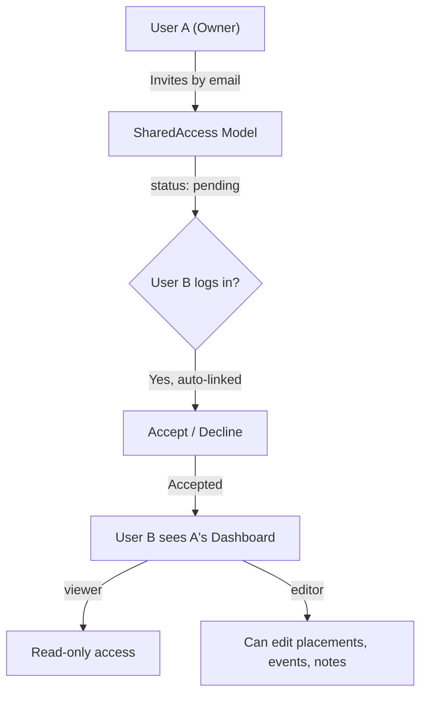

# 🤝 Dashboard Sharing Feature — Implementation Summary

## What Was Built

A full **permission-based dashboard sharing system** that lets users invite classmates to view or edit their placement dashboards.

## Architecture

## Files Created

| File | Purpose |
|---|---|
| [`SharedAccess.ts`](file:///d:/Full-stack/PlacemateAI/src/models/SharedAccess.ts) | MongoDB model — stores sharing relationships with permission levels |
| [`shared-access.ts`](file:///d:/Full-stack/PlacemateAI/src/lib/shared-access.ts) | Core utility — `checkSharedAccess()` used by all API routes |
| [`/api/sharing/route.ts`](file:///d:/Full-stack/PlacemateAI/src/app/api/sharing/route.ts) | GET (list sharing) + POST (invite friend) |
| [`/api/sharing/[id]/route.ts`](file:///d:/Full-stack/PlacemateAI/src/app/api/sharing/%5Bid%5D/route.ts) | PATCH (accept/reject/update) + DELETE |
| [`/api/sharing/dashboard/[ownerId]/route.ts`](file:///d:/Full-stack/PlacemateAI/src/app/api/sharing/dashboard/%5BownerId%5D/route.ts) | Fetch shared user's dashboard stats |
| [`SharingManager.tsx`](file:///d:/Full-stack/PlacemateAI/src/components/SharingManager.tsx) | Full sharing management UI — invite, accept, revoke |
| [`DashboardSwitcher.tsx`](file:///d:/Full-stack/PlacemateAI/src/components/DashboardSwitcher.tsx) | Dropdown to switch between own & shared dashboards |

## Files Modified

| File | Change |
|---|---|
| [`auth.ts`](file:///d:/Full-stack/PlacemateAI/src/lib/auth.ts) | Auto-link pending invitations on sign-in |
| [`placements/route.ts`](file:///d:/Full-stack/PlacemateAI/src/app/api/placements/route.ts) | Added `ownerId` query param + shared access check |
| [`placements/[id]/route.ts`](file:///d:/Full-stack/PlacemateAI/src/app/api/placements/%5Bid%5D/route.ts) | Editor permission check before PATCH |
| [`placements/search/route.ts`](file:///d:/Full-stack/PlacemateAI/src/app/api/placements/search/route.ts) | Shared access for search queries |
| [`dashboard/page.tsx`](file:///d:/Full-stack/PlacemateAI/src/app/dashboard/page.tsx) | Integrated DashboardSwitcher + SharingManager |
| [`placements/[id]/page.tsx`](file:///d:/Full-stack/PlacemateAI/src/app/placements/%5Bid%5D/page.tsx) | Shared access check for viewing friend's placements |
| [`PlacementList.tsx`](file:///d:/Full-stack/PlacemateAI/src/components/PlacementList.tsx) | `sharedOwnerId` prop for fetching shared data |
| [`placement.ts`](file:///d:/Full-stack/PlacemateAI/src/types/placement.ts) | Added `sharedPermission` to props |
| [`Navbar.tsx`](file:///d:/Full-stack/PlacemateAI/src/components/Navbar.tsx) | Added Users icon import |

## How It Works

1. **Invite**: Click "Share Dashboard" → Enter friend's email → Choose viewer/editor
2. **Accept**: Friend logs in → Sees pending invitation → Clicks Accept
3. **View**: Friend uses Dashboard Switcher dropdown → Selects your name → Sees your full dashboard
4. **Edit** (if editor): Friend can modify placements, change statuses, add notes — all changes persist in your MongoDB data
5. **Revoke**: Either party can revoke access at any time

## Key Design Decisions

- **No new auth system** — leverages existing NextAuth sessions
- **Email-based invitations** — works even before the friend has an account (auto-links on signup)
- **Minimal API changes** — existing routes enhanced with optional `ownerId` param, no breaking changes
- **Single permission check function** — `checkSharedAccess()` is the only gate for all routes

## TypeScript Compilation: ✅ Zero Errors
